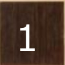
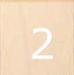
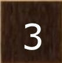
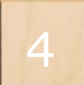
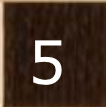
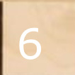
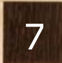

## Description
This class **operations** contains functions made to perform the operations needed throughout 
the the process of the vision system of Playmate3000.
The class includes three main functions : ***reArrange*** , ***getCorners*** and ***imageSlices***

### a)reArrange(list_array,r,c)
*list_array*: is a list of pair elements to be arranged as r by c arranged matrix
*r*: number of rows of the reArranged matrix 
*c*: number of columns of the reArranged matrix

the funtion --reArrange-- does the job of taking a --list_array-- containing pair elements (x and y, as an image array of pixels)
and its rows --r-- and columns --c-- as an input and gives a sorted matrix in ascending order as an output.

#### example
let try re-arranging the next 64 pair list of elements
```

map=[
    [10, 15],[7, 5],[6, 23],[9, 43],[44, 9],[21, 3],[34, 100],[23,55],
    [89, 67],[1, 67],[134, 89],[89, 56],[43, 76],[32, 12],[133, 12],[91, 66],
    [9, 8], [51, 15], [15, 71], [17, 98], [23, 92], [167, 157], [135, 126], [126, 67],
    [10, 15], [8, 16], [6, 23], [9, 43], [44, 9], [21, 3], [34, 100], [23, 55],
    [89, 67], [1, 67], [134, 89], [89, 56], [43, 76], [32, 12], [133, 12], [91, 66],
    [9, 8], [51, 15], [66, 23], [17, 98], [23, 92], [167, 157], [135, 126], [126, 67],
    [10, 15], [8, 16], [6, 23], [9, 43], [44, 9], [21, 3], [34, 100], [23, 55],
    [89, 67], [1, 67], [134, 89], [89, 56], [43, 76], [32, 12], [133, 12], [91, 66],
]
```

so simply we give the inputs for the function as: **reArrange**(map,8,8)

the output would be:
```
[
[[7, 5], [9, 8], [21, 3], [32, 12], [44, 9], [51, 15], [133, 12], [133, 12]],
[[8, 16], [9, 8], [21, 3], [32, 12], [44, 9], [51, 15], [133, 12], [134, 89]],
[[6, 23], [10, 15], [21, 3], [32, 12], [44, 9], [66, 23], [89, 56], [134, 89]],
[[6, 23], [10, 15], [10, 15], [23, 55], [43, 76], [89, 56], [91, 66], [134, 89]],
[[6, 23], [8, 16], [23, 55], [23, 55], [43, 76], [89, 56], [91, 66], [135, 126]],
[[1, 67], [9, 43], [15, 71], [23, 92], [43, 76], [89, 67], [91, 66], [135, 126]], 
[[1, 67], [9, 43], [17, 98], [23, 92], [34, 100], [89, 67], [126, 67], [167, 157]],
[[1, 67], [9, 43], [17, 98], [34, 100], [34, 100], [89, 67], [126, 67], [167, 157]]
]
```


as we see, it is arranged based on both the x and y axis, as an array of pixels in image.


### b)getCorners(mapped)
the function ***getCorners*** extracts the corners of the board out of the mapped matrix of the given intersections coordinates.
it gets the mapped matrix as input and four coordinates (x,y) of corners: top-left, top-right, bottom-left, bottom-right.

#### example

let's take an example of already rearranged matrix using reArrange function: 
```
[[14, 9], [21, 3], [32, 12], [32, 12], [44, 9], [66, 23], [133, 12], [133, 12]]
[[10, 12], [21, 3], [23, 55], [32, 12], [44, 9], [91, 43], [133, 12], [134, 13]]
[[12, 12], [21, 3], [23, 55], [34, 47], [44, 9], [89, 56], [93, 33], [134, 15]]
[[9, 13], [16, 23], [23, 55], [43, 76], [51, 15], [89, 56], [91, 66], [134, 20]]
[[10, 15], [19, 43], [22, 57], [43, 76], [51, 15], [89, 56], [91, 66], [135, 126]]
[[10, 15], [15, 71], [30, 67], [34, 100], [46, 23], [89, 67], [91, 66], [135, 126]]
[[10, 15], [17, 98], [23, 92], [34, 100], [61, 23], [89, 67], [126, 67], [167, 157]]
[[10, 80], [17, 98], [23, 92], [34, 100], [43, 76], [89, 67], [126, 67], [167, 157]]
```

using the function getCorners we get the four corners of the above matrix:

**getCorners(mapped)**

we get as a result:
```
[[7, 6], [133, 11], [3, 62], [208, 157]]
```

### c)imageSlices(image, mapped_matrix, corners)

the function ***imageSlices*** does the job of cutting the squares of the board in the scene containing the pieces in order to check 
whether a peice exists or not in that square later on using another function. 
so the inputs are the image ( which is the scene frame ), the already mapped matrix of intersections, and finally the gotten corners from the function getCorners or from wherever.
it takes these inputs and produces a number of small image squares as an output in an array ( the number of squares depends on the mapped_matrix ) 

#### example
for example let's take this camera frame:
which is 8x8 matrix of black and white squares.


using the above function we can get the chessboard squares, which results in the small following images:

             
.
  
... and so on.

### d) imageSlices2(frame,height=400, width=400,r=8,c=8)

this function simply cuts down the whole frame into small squares from the begining till the end.
by default the height and the width of the frame are 400x400, and the rows and columns are 8 by 8 as well.

#### example

let take the next image as an example :


this image has height of 852 and width of 859
so the function would be as following:

*imageSlices2(image, height=852, width=859)* 
r and c are the same as we want (8,8)

so the output would be as small images:

              
... and so on until 64.


### e) getCorners2(mapped)

This is another version for getting corners, the other version getCorners has some glitches in detecting the corners if the board is not well aligned, while this version works for any direction and any angle of the board, even if the board is not that aligned. 
the syntax is simply the same for both functions.


